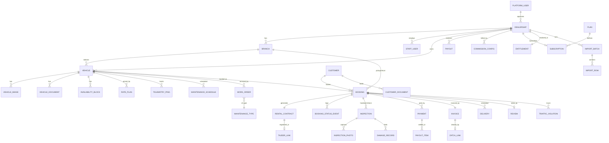

# Miqwad — Data Model

The V1 entity model and the physical PostgreSQL schema the team builds from: entities and relationships, multi-tenancy, enums, money, and the physical-schema features (the GiST exclusion constraint, RLS, partitioning, key indexes) that the application must respect.

> **Scope.** V1 covers the full core plus the three features pulled into the 4-month milestone — **multi-branch**, **fleet tracking**, and **maintenance / maintenance tracking** — with forward-compatible stubs for later releases. The DDL below mirrors the Flyway baseline (`V1__baseline.sql`) + the seed migration; subsequent changes are **forward-only** Flyway migrations.

> 🟡 **Provisional — STATUS [P-12](../STATUS.md).** The exact data and documents a dealer keeps per rental are still to be confirmed in dealer discovery. Some flow-driven fields (rate-plan rules, inspection capture, what is recorded per channel, maintenance fields) may be refined afterward. Build behind the stable table shapes here; expect leaf-field detail to firm up.

Decisions are recorded in [decisions/adr-log.md](../decisions/adr-log.md): keys/schema **ADR-006**, tenancy **ADR-003**, no-double-booking **ADR-004**, money **ADR-005**, telemetry partitioning + PostGIS **ADR-011**.

---

## Status legend

| Badge | Meaning |
|---|---|
| ✅ **Decided** | Settled. Build to it. |
| 🟡 **Provisional** | Shape is set; leaf-field detail refined after an external input (dealer discovery / vendor docs). |
| 🔵 **Open** | A genuine decision not yet made. |

---

## 1. Conventions ✅

| Concern | Rule |
|---|---|
| **Primary keys** | **UUIDv7** (RFC 9562, time-ordered), application-generated via a shared Kotlin/JVM factory at entity creation. Time-ordered keys keep inserts roughly sequential, avoiding the index fragmentation, page splits, and cache-locality loss random v4 keys cause on hot tables (`telemetry_ping`, `booking`, ledger/audit). DB default `gen_random_uuid()` (pgcrypto) is a fallback only. **Exception:** any id exposed in a public, customer-facing URL uses **UUIDv4** (v7 encodes creation time, which is enumerable/time-readable by anyone holding the id). Native `uuidv7()` exists only from PostgreSQL 18. |
| **Timestamps** | `timestamptz` (UTC): `created_at`, `updated_at`, and `deleted_at` (soft delete) where noted. |
| **Money** | Integer **halalas** (1 SAR = 100) in a `*_amount bigint` column + `currency char(3)` (always `SAR` in V1). Never float, never `BigDecimal`-as-currency. |
| **Tenancy** | Every tenant-owned table carries `dealership_id uuid not null` (§3) + an RLS policy (§9). |
| **Enums** | Postgres `CREATE TYPE … AS ENUM` (§5), mapped in Kotlin/JPA as `@Enumerated` with a converter or as typed strings. |
| **Naming** | snake_case tables/columns; FKs `…_id`; indexes `ix_<table>_<cols>`; uniques `uq_…`. |

**Stack ownership.** Entities are JPA/Hibernate `@Entity` classes on **Kotlin 2.x (K2) / JDK 25 / Spring Boot 4** (Spring Modulith, coroutines-first). The schema is owned by **Flyway migrations**, not Hibernate auto-DDL (disabled outside local dev): tables, indexes, constraints, enums, the exclusion constraint, RLS policies, and partitions all live in migrations, the last few as raw SQL beyond standard JPA mapping. Money columns map to a `@JvmInline value class` (`amount: Long` halalas + currency). Pooling via HikariCP; RLS session variables are set per-transaction (`SET LOCAL`) so they never leak across pooled connections.

**Platform: PostgreSQL 17 on Cloud SQL (me-central2).** Major version **17** (decided 2026-06-30; ADR-002). Extensions, all on the Cloud SQL allow-list: `postgis`, `pg_partman` (5.x), `btree_gist` (the exclusion constraint), `pgcrypto`. **TimescaleDB is intentionally not used** (ADR-011).

---

## 2. Multi-tenancy ✅ (ADR-003)

**Model: shared database, shared schema, row-level isolation by `dealership_id`.** Isolation is enforced **twice**:

1. **Application layer (primary guard)** — every query is scoped to the authenticated dealership via Hibernate **`@TenantId`** (auto-applied filter + auto-populated insert), so a developer never writes the filter by hand and no query can accidentally span tenants. `dealership_id` is **always derived from the JWT claim, never from request input**.
2. **Database layer (defense in depth)** — PostgreSQL **Row-Level Security** policies on every tenant table (§9), keyed on a per-transaction session variable (`app.current_dealership`). RLS is the **hard backstop** — it catches what the ORM filter misses (native queries, an Elide mis-config).

The tenant id must survive coroutine suspension and thread hops to reach both Hibernate's resolver and the per-transaction `SET LOCAL`. It lives in a `ThreadLocal` carried into coroutines as a context element, with `ScopedValue` (GA in JDK 25) on blocking / `StructuredTaskScope` paths. **Background jobs pass `dealership_id` explicitly and never inherit it.**

**Why not schema-/database-per-tenant?** A long tail of hundreds of small dealerships (5–500 cars) makes per-tenant schemas/databases a migration and connection-pool nightmare at scale. Row-level isolation is the right trade-off for this tenant profile.

**Platform-scoped tables carry no `dealership_id`** — `customer`, `customer_document`, `dealership`, `platform_user`, `plan`, `commission_config`, `review`, `maintenance_type`, `outbox`, `idempotency_key`, `notification` — because customers and the platform team span all tenants (a customer is one identity that rents from many dealerships).

---

## 3. Entity-relationship overview



### Entity map by bounded context

| Context | Entities |
|---|---|
| **Identity & tenancy** | `dealership` (tenant root, platform-scoped), `branch`, `staff_user`, `customer` (platform-scoped), `customer_document` (platform-scoped, restricted) |
| **Packaging & billing** | `plan`, `subscription`, `entitlement`, `commission_config` (all platform-scoped) |
| **Fleet** | `vehicle`, `vehicle_category`, `vehicle_image`, `vehicle_document`, `telemetry_ping` (partitioned) |
| **Availability & pricing** | `rate_plan`, `availability_block` |
| **Booking & contract** | `booking`, `booking_status_event`, `rental_contract` (Tajeer), `tajeer_link` |
| **Inspection & damage** | `inspection`, `inspection_photo`, `damage_record`, `delivery` |
| **Payments, invoicing, settlement** | `payment`, `invoice` (ZATCA), `zatca_link`, `payout`, `payout_item`, `ledger_entry` |
| **Maintenance** | `maintenance_type` (platform ref), `maintenance_schedule`, `work_order` |
| **Reviews & Saher** | `review` (platform-scoped), `traffic_violation` |
| **Cross-cutting** | `outbox`, `idempotency_key`, `notification`, `import_batch`, `import_row`, `platform_user` |

---

## 4. Core entities (conceptual)

### 4.1 Identity & tenancy
- **`dealership`** — tenant root. `legal_name`, `display_name`, `cr_number`, `vat_number`, `tga_license_no`, `status`, `tajeer_account_ref`, `zatca_onboarded`, `commission_rate_bps` (per-dealer override), contacts.
- **`branch`** — `name`, `city`, `address`, geo point (nearest-branch search), `working_hours` (jsonb), `status`.
- **`staff_user`** — `branch_id` null = all branches; `role` (`owner`/`manager`/`branch_agent`/`accountant`); `auth_subject` → Keycloak.
- **`customer`** (platform-scoped) — `phone` (unique, OTP login), `national_id_type`, `national_id_masked` (last 4 only), `absher_verified`, `status`.

> **PII / PDPL.** Full national ID, license number, and document images live encrypted at rest in the restricted `customer_document` table (KSA-resident), column-encrypted with access logging via Cloud KMS envelope encryption. Only masked values appear in operational queries.

### 4.2 Fleet
- **`vehicle`** — the heart of fleet tracking. Identity (make/model/year/trim/`vin`/`plate_number`/`plate_type`), spec (`transmission`, `fuel_type`, `seats`), `odometer_km`, `status` (`available`/`rented`/`maintenance`/`out_of_service`/`draft`), Tajeer fields (`operating_card_*`, `insurance_*`), denormalized `live_geo`, `source` (`live`/`imported`).
- **`vehicle_category`**, **`vehicle_image`**, **`vehicle_document`** — categories, ordered images, and `istimara`/`insurance`/`operating_card` docs.
- **`telemetry_ping`** — high-write, append-only time-series (geo, `speed_kmh`, `odometer_km`, `ignition`, `source` = `gps_device`/`obd`/`manual`/`wasl`, `recorded_at`/`received_at`). See §7 for partitioning.

> **Fleet-tracking design.** Current position/odometer is denormalized onto `vehicle` (and a `vehicle_live` Redis cache) for fast dashboards; the partitioned table holds history. Device integration is provider-agnostic via `source`, so GPS hardware, OBD dongles, and a future Wasl feed land in one shape.

### 4.3 Availability & pricing
- **`rate_plan`** — per-vehicle or per-category: `daily`/`weekly`/`monthly_amount`, `deposit_amount`, `included_km_per_day`, `extra_km_amount`, `min`/`max_rental_days`, `active_from`/`active_to` (seasonal).
- **`availability_block`** — the rental-availability core: `start_at`/`end_at`, `reason` (`booking`/`maintenance`/`manual_hold`/`transfer`), with `booking_id` / `work_order_id` set per reason.

> **The key divergence from e-commerce.** A rental vehicle is a single resource on a time calendar, not a stock count. Availability = the **absence of an overlapping block**: a vehicle is free for `[from, to]` iff no `availability_block` overlaps it. Every confirmed booking and every scheduled maintenance writes a block. A denormalized 90-day availability cache lives in Redis for marketplace search; the block table is the source of truth.

### 4.4 Booking & contract
- **`booking`** — `pickup`/`return_branch_id` (one-way capable), `pickup_at`/`return_at`, `status` (`pending` → `confirmed` → `active` → `completed`, branches `cancelled`/`no_show`), `rate_plan_snapshot` (frozen pricing), money fields (`rental`/`deposit`/`vat`/`total_amount`), `commission_bps`/`commission_amount` (marketplace only), `channel` (`marketplace`/`dealer_direct`/`walk_in`/`external_aggregator`) + `channel_source`, `source` (`live`/`imported`).
- **`booking_status_event`** — audit trail of every transition (`from`/`to_status`, `actor_type`, `actor_id`, `note`).
- **`rental_contract`** — Tajeer e-contract: `tajeer_contract_ref`, `status` (`draft`/`submitted`/`registered`/`closed`/`failed`), `signed_at`, `raw_payload`, `source` (`imported` ⇒ never re-registered).
- **`tajeer_link`** — integration audit (one shape with `zatca_link`).

### 4.5 Inspection, handover & damage (the trust differentiator)
- **`inspection`** — `type` (`handover`/`return`), `odometer_km`, `fuel_level`, agent, `customer_present`, `signed_at`.
- **`inspection_photo`** — `angle`, `captured_at`, geotag, `perceptual_hash` (tamper-evidence).
- **`damage_record`** — `area`, `severity` (`minor`/`moderate`/`major`), `estimated_amount`, `photo_id`, `resolved`.

> **Evidence design.** Photos are mandatory at both handover and return, timestamped and geotagged at capture, hashed for tamper-evidence, retained ≥12 months — turning damage disputes from "he-said/she-said" into evidence, the structural fix for the #1 complaint about incumbents.

### 4.6 Payments, invoicing & settlement
- **`payment`** — `type` (`rental`/`deposit_hold`/`deposit_capture`/`deposit_refund`/`extra_charge`/`fine`), `method` (Mada/cards/Apple Pay/STC Pay), `provider` = **Moyasar**, `provider_ref`, `status`.
- **`invoice`** — ZATCA e-invoice: `type` (`simplified` B2C / `standard` B2B), `direction` (`dealer_to_customer` default, `platform_to_dealer` for Miqwad billing the dealer), `zatca_uuid`, `zatca_hash` (PIH chain), `qr_payload` (TLV base64), `clearance_status`, `source` (`imported` ⇒ never re-cleared).
- **`payout`** / **`payout_item`** — period settlement to dealership (`gross`/`commission`/`net_amount`).
- **`ledger_entry`** — **append-only money ledger** (see §6).
- **`commission_config`** (platform-scoped) — `base_rate_bps`, `saas_plan`, per-vehicle/per-branch fees, `effective_from`; `dealership_id` null = global default.

### 4.7 Maintenance & tracking
- **`maintenance_type`** (platform ref) — `code` (oil_change, tire_rotation, …), default km/day intervals.
- **`maintenance_schedule`** — preventive: `interval_km`/`interval_days`, `last_done_*`, `next_due_*`, `status` (`ok`/`due_soon`/`overdue`).
- **`work_order`** — work performed: `status` (`scheduled`/`in_progress`/`completed`/`cancelled`), `vendor_name`, `cost_amount`, timestamps.

> **Maintenance-tracking design.** Scheduling a `work_order` writes an `availability_block` (`reason = maintenance`) and sets `vehicle.status = maintenance`. On completion, the linked schedule recomputes `next_due_*`, the block releases, and the vehicle returns to `available`. A nightly job recomputes schedule statuses and raises dashboard alerts.

### 4.8 Packaging, entitlements & channels
- **`plan`** (platform ref) — package×tier catalog: `package` (`management`/`marketplace`/`both`), `tier` (`free`/`standard`/`pro`), `price_amount`, `enabled_modules` (jsonb flags), `limits` (jsonb caps), `commission_rate_bps`.
- **`subscription`** (one active per dealership) — `plan_id`, `status`, period, `overrides`.
- **`entitlement`** (derived/cached) — the **effective** resolved `modules` + `limits` for a dealership; recomputed on subscription change, cached in Redis/Caffeine, enforced server-side (→ 402/403) and reflected in FE nav.
- **Channels & commission** — channel lives on `booking`. **Commission accrues only on `marketplace`**; `dealer_direct`/`walk_in`/`external_aggregator` incur none. All channels write an `availability_block`. External-aggregator bookings are entered manually in V1.

### 4.9 Delivery, migration, reviews, Saher
- **`delivery`** — optional door-step delivery/collection: `type`, address + geo, window, `fee_amount`, `status`.
- **`import_batch`** / **`import_row`** — historical migration. Rows are idempotent (dedup key per entity); bad rows are quarantined, not batch-failing. Imported Tajeer contracts and ZATCA invoices (`source = imported`) are **excluded from registration/clearance sagas and reconciliation** — already filed with the government, never re-submitted.
- **`review`** (platform-scoped) — `rating` 1–5, `comment`, `status`; affects listing visibility/ranking.
- **`traffic_violation`** — Saher passthrough: fines during the rental window attributed to the renter on record.

### 4.10 Forward-compatible stubs (later releases — schema reserved, no V1 endpoints)
`promotion`/`coupon` (discount engine), `loyalty_account`/`loyalty_transaction` (rewards), `corporate_account`/`corporate_member` (business accounts). **`wasl_registration`** is conditional — built only if TGA confirms passenger rental fleets must integrate with Wasl (**pending verification**). `review` and `traffic_violation` were promoted into V1 (§4.9).

---

## 5. Enumerated types ✅

All enums are Postgres `CREATE TYPE … AS ENUM`. The full set:

```sql
CREATE TYPE dealership_status   AS ENUM ('pending','active','suspended','rejected');
CREATE TYPE branch_status       AS ENUM ('active','inactive');
CREATE TYPE staff_role          AS ENUM ('owner','manager','branch_agent','accountant');
CREATE TYPE staff_status        AS ENUM ('active','invited','disabled');
CREATE TYPE customer_status     AS ENUM ('active','blocked');
CREATE TYPE national_id_type    AS ENUM ('national_id','iqama','gcc_id','passport');
CREATE TYPE vehicle_status      AS ENUM ('available','rented','maintenance','out_of_service','draft');
CREATE TYPE transmission_type   AS ENUM ('automatic','manual');
CREATE TYPE fuel_type           AS ENUM ('petrol','diesel','hybrid','electric');
CREATE TYPE block_reason        AS ENUM ('booking','maintenance','manual_hold','transfer');
CREATE TYPE booking_status      AS ENUM ('pending','confirmed','active','completed','cancelled','no_show','confirmation_failed');
CREATE TYPE booking_channel     AS ENUM ('marketplace','dealer_direct','walk_in','external_aggregator');
CREATE TYPE record_source       AS ENUM ('live','imported');
CREATE TYPE contract_status     AS ENUM ('draft','submitted','registered','closed','failed');
CREATE TYPE inspection_type     AS ENUM ('handover','return');
CREATE TYPE damage_severity     AS ENUM ('minor','moderate','major');
CREATE TYPE payment_type        AS ENUM ('rental','deposit_hold','deposit_capture','deposit_refund','extra_charge','fine');
CREATE TYPE payment_method      AS ENUM ('mada','visa','mastercard','apple_pay','stc_pay');
CREATE TYPE payment_provider    AS ENUM ('moyasar');
CREATE TYPE payment_status      AS ENUM ('initiated','authorized','captured','failed','refunded');
CREATE TYPE invoice_type        AS ENUM ('simplified','standard');
CREATE TYPE invoice_direction   AS ENUM ('dealer_to_customer','platform_to_dealer');
CREATE TYPE clearance_status    AS ENUM ('pending','cleared','reported','failed');
CREATE TYPE payout_status       AS ENUM ('pending','paid');
CREATE TYPE maint_status        AS ENUM ('ok','due_soon','overdue');
CREATE TYPE work_order_status   AS ENUM ('scheduled','in_progress','completed','cancelled');
CREATE TYPE telemetry_source    AS ENUM ('gps_device','obd','manual','wasl');
CREATE TYPE pkg_type            AS ENUM ('management','marketplace','both');
CREATE TYPE pkg_tier            AS ENUM ('free','standard','pro');
CREATE TYPE subscription_status AS ENUM ('trialing','active','past_due','suspended','cancelled');
CREATE TYPE delivery_type       AS ENUM ('delivery','collection');
CREATE TYPE delivery_status     AS ENUM ('scheduled','en_route','completed','cancelled');
CREATE TYPE import_entity       AS ENUM ('vehicle','customer','booking','contract','invoice','maintenance');
CREATE TYPE import_batch_status AS ENUM ('uploaded','validating','validated','importing','completed','failed');
CREATE TYPE import_row_status   AS ENUM ('pending','imported','quarantined');
CREATE TYPE review_status       AS ENUM ('published','hidden');
CREATE TYPE violation_status    AS ENUM ('recorded','attributed','charged','disputed');
CREATE TYPE outbox_status       AS ENUM ('pending','dispatched','failed');
CREATE TYPE notif_channel       AS ENUM ('push','sms','email','in_app');
CREATE TYPE notif_status        AS ENUM ('queued','sent','failed');
```

> `booking_status` carries a `confirmation_failed` terminal branch (the saga-compensation outcome when confirm fails after payment). `payment_provider` is `moyasar` for V1; the payment adapter is provider-agnostic, so introducing another provider later is a migration + adapter change, not a re-architecture (ADR-015).

---

## 6. Money — integer halalas + append-only ledger ✅ (ADR-005)

All amounts are integer **halalas** (1 SAR = 100) + explicit `currency` — never floats. Money maps to a Kotlin `@JvmInline value class` (type-safe, zero-allocation, impossible to confuse with a raw `Long`). Every money movement is an **immutable ledger entry**; balances are **derived, never edited**.

```sql
-- Append-only money ledger (ADR-005). Never UPDATE/DELETE.
CREATE TABLE ledger_entry (
  id uuid PRIMARY KEY, dealership_id uuid NOT NULL REFERENCES dealership(id),
  booking_id uuid, account text NOT NULL,           -- e.g. deposit_hold, commission, payout, vat
  amount bigint NOT NULL, currency char(3) NOT NULL DEFAULT 'SAR',
  ref_type text, ref_id uuid, memo text,
  created_at timestamptz NOT NULL DEFAULT now()
);
CREATE INDEX ix_ledger_dealership ON ledger_entry(dealership_id, created_at);
```

`ledger_entry` and `outbox` are **append-only** — no service may UPDATE/DELETE them, enforced by code review **and** a prod DB role lacking UPDATE/DELETE on these tables. All `*_amount` columns are `bigint` halalas; add a `CHECK >= 0` per column in the real migration wherever a negative is impossible.

---

## 7. Physical schema highlights

The full DDL is the Flyway baseline. The features below are load-bearing — **application code must not assume it can skip them.**

### 7.1 No double-booking — `tstzrange` + GiST exclusion constraint ✅ (ADR-004)

`availability_block` is the **only** place double-booking is *prevented*, at the database level, for **all channels**. The exclusion constraint requires `btree_gist`.

```sql
CREATE TABLE availability_block (
  id uuid PRIMARY KEY,
  dealership_id uuid NOT NULL REFERENCES dealership(id),
  vehicle_id uuid NOT NULL REFERENCES vehicle(id),
  start_at timestamptz NOT NULL, end_at timestamptz NOT NULL,
  reason block_reason NOT NULL,
  booking_id uuid, work_order_id uuid,
  CONSTRAINT no_overlap EXCLUDE USING gist (
    vehicle_id WITH =, tstzrange(start_at, end_at) WITH &&
  )
);
CREATE INDEX ix_block_vehicle ON availability_block(vehicle_id);
```

The loser of a concurrent race gets a clean `vehicle_unavailable`, never a corrupt state. Every confirmed booking and every scheduled maintenance work order **must** write a block.

### 7.2 Row-Level Security ✅ (ADR-003)

Applied to **every tenant-owned table** (those carrying `dealership_id`). The app also enforces the tenant filter via `@TenantId`; RLS is the hard backstop. Pattern repeated per table:

```sql
-- Tenant scope is carried in a per-transaction GUC, set by the app via SET LOCAL.
CREATE OR REPLACE FUNCTION app_current_dealership() RETURNS uuid
LANGUAGE sql STABLE AS $$
  SELECT NULLIF(current_setting('app.current_dealership', true), '')::uuid
$$;

ALTER TABLE vehicle ENABLE ROW LEVEL SECURITY;
ALTER TABLE vehicle FORCE ROW LEVEL SECURITY;
CREATE POLICY tenant_isolation ON vehicle
  USING (dealership_id = app_current_dealership())
  WITH CHECK (dealership_id = app_current_dealership());
```

- Same policy on every tenant table: `branch`, `staff_user`, `rate_plan`, `availability_block`, `booking`, `booking_status_event`, `rental_contract`, `inspection`, `inspection_photo`, `damage_record`, `delivery`, `payment`, `invoice`, `payout`, `payout_item`, `ledger_entry`, `maintenance_schedule`, `work_order`, `telemetry_ping`, `traffic_violation`, `subscription`, `entitlement`, `import_batch`, `import_row`, `vehicle_image`, `vehicle_document`, and `vehicle_category` (when dealership-scoped).
- The app sets the GUC per transaction: `SET LOCAL app.current_dealership = '<uuid-from-jwt>'` (compatible with PgBouncer transaction pooling; the helper returns NULL → no rows when unset).
- **Platform-scoped tables** (`dealership`, `customer`, `customer_document`, `platform_user`, `plan`, `commission_config`, `review`, `maintenance_type`, `outbox`, `idempotency_key`, `notification`) are **not** under tenant RLS; access is governed by application role checks (and `customer_document` additionally by column encryption + access logging).
- Jobs that legitimately cross tenants (import, reconciliation) use a dedicated DB role exempt from `FORCE RLS`, used only by audited server jobs.

### 7.3 Telemetry partitioning ✅ (ADR-011)

`telemetry_ping` (~270 pings/s) uses **native monthly RANGE partitioning + `pg_partman`**. The PK includes the partition key (`recorded_at`). Partition creation/pruning runs as a **JobRunr scheduled job** (Cloud SQL omits pg_partman's background worker).

```sql
CREATE TABLE telemetry_ping (
  id uuid NOT NULL,
  dealership_id uuid NOT NULL, vehicle_id uuid NOT NULL,
  geo geography(Point,4326), speed_kmh int, odometer_km int, ignition boolean,
  source telemetry_source, recorded_at timestamptz NOT NULL, received_at timestamptz NOT NULL DEFAULT now(),
  PRIMARY KEY (id, recorded_at)
) PARTITION BY RANGE (recorded_at);
SELECT partman.create_parent('public.telemetry_ping','recorded_at','native','monthly');
CREATE INDEX ix_telemetry_vehicle_time ON telemetry_ping(vehicle_id, recorded_at DESC);
```

### 7.4 PostGIS geography ✅ (ADR-011)

Geo columns are PostGIS `geography(Point,4326)` with GiST spatial indexes — used for nearest-branch/radius marketplace search, the live fleet map, and geofencing. Present on `branch.geo`, `vehicle.live_geo` (denormalized current position), `inspection_photo.geo`, `telemetry_ping.geo`, `delivery.geo`. Example:

```sql
CREATE INDEX ix_branch_geo ON branch USING gist(geo);
```

### 7.5 Saga durability & idempotency ✅

- **`outbox`** — the transactional-outbox source of truth, dispatched by JobRunr; partial index on undispatched rows. **Append-only.**
- **`idempotency_key`** — `key` PK + stored `response_status`/`response_body`, so every money- or external-system-touching endpoint is processed once.

```sql
CREATE TABLE outbox (
  id uuid PRIMARY KEY, aggregate_type text, aggregate_id uuid,
  event_type text NOT NULL, payload jsonb NOT NULL,
  status outbox_status NOT NULL DEFAULT 'pending', attempts int NOT NULL DEFAULT 0,
  next_attempt_at timestamptz, created_at timestamptz NOT NULL DEFAULT now(), dispatched_at timestamptz
);
CREATE INDEX ix_outbox_pending ON outbox(status, next_attempt_at) WHERE status <> 'dispatched';

CREATE TABLE idempotency_key (
  key text PRIMARY KEY, dealership_id uuid, endpoint text,
  request_hash text, response_status int, response_body jsonb,
  created_at timestamptz NOT NULL DEFAULT now()
);
```

### 7.6 Key indexes & guard constraints

| Table | Indexes / constraints |
|---|---|
| `branch` | `ix_branch_dealership`, `ix_branch_geo` (GiST) |
| `staff_user` | `ix_staff_dealership`; `auth_subject` UNIQUE |
| `subscription` | `uq_subscription_active` — partial UNIQUE on `dealership_id` WHERE status IN (`trialing`,`active`,`past_due`) → **one active subscription per dealership** |
| `vehicle` | `ix_vehicle_dealership`, `ix_vehicle_status (dealership_id,status)` |
| `availability_block` | `no_overlap` EXCLUDE (§7.1), `ix_block_vehicle` |
| `booking` | `ix_booking_dealership_status`, `ix_booking_vehicle`; `CHECK (return_at > pickup_at)`; `CHECK (channel <> 'external_aggregator' OR channel_source IS NOT NULL)` |
| `rental_contract` | `booking_id` UNIQUE (one contract per booking) |
| `payment` | `ix_payment_booking` |
| `ledger_entry` | `ix_ledger_dealership (dealership_id, created_at)` |
| `telemetry_ping` | `ix_telemetry_vehicle_time (vehicle_id, recorded_at DESC)` (§7.3) |
| `outbox` | `ix_outbox_pending` (partial, §7.5) |
| `import_row` | `ix_import_row_batch (import_batch_id, status)` |
| `review` | `CHECK (rating BETWEEN 1 AND 5)` |

### 7.7 Seed (separate migration `V2__seed_plans.sql`)

Seeds the `plan` catalog (package×tier matrix), the global `commission_config` default, `maintenance_type` reference rows, and `vehicle_category` reference codes. 🟡 Prices/limits are proposals pending sign-off.

---

## 8. Key invariants & rules ✅

| # | Invariant |
|---|---|
| 1 | **No double-booking** — enforced by the `availability_block` exclusion constraint, not just application logic; **all channels write a block** (no cross-channel double-booking). |
| 2 | **Tenant isolation** — no query touches another dealership's rows; `dealership_id` always comes from the JWT, never the request body; enforced by `@TenantId` + RLS. |
| 3 | **Money never floats** — all amounts are integer halalas; every movement is an append-only `ledger_entry`; balances derived. |
| 4 | **Booking guards** — `→ confirmed` needs a successful `payment` (and, where required, a Tajeer `rental_contract` in `registered`); `→ active` needs a `handover` inspection with the minimum required photos; `→ completed` needs a `return` inspection and a `cleared`/`reported` ZATCA invoice. |
| 5 | **Commission by channel** — only `booking.channel = marketplace` incurs Miqwad commission; `dealer_direct`, `walk_in`, `external_aggregator` incur none. |
| 6 | **Entitlement gating** — every dealer action is gated server-side by the resolved `entitlement` (module/limit/package → 402/403). Tenant scope and entitlement are independent checks; both apply. |
| 7 | **Imported-document guard** — `source = imported` rows on `rental_contract`/`invoice` are already-filed government documents, excluded from registration/clearance sagas and reconciliation; never re-submitted. |
| 8 | **Append-only tables** — `ledger_entry` and `outbox` are never UPDATEd/DELETEd (code review + a prod DB role without UPDATE/DELETE on them). |

---

## Related

- [decisions/adr-log.md](../decisions/adr-log.md) — ADR-003 (tenancy), ADR-004 (no double-booking), ADR-005 (money/ledger), ADR-006 (keys/Flyway), ADR-011 (telemetry/PostGIS).
- [STATUS.md](../STATUS.md) — **P-12** (data/documents per rental — drives the leaf-field detail and migration) and the full register of Provisional / Open items.
