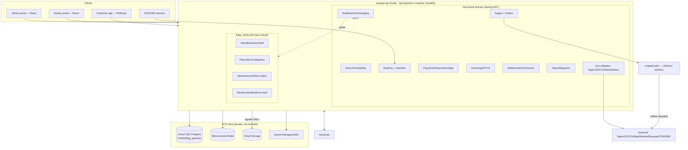
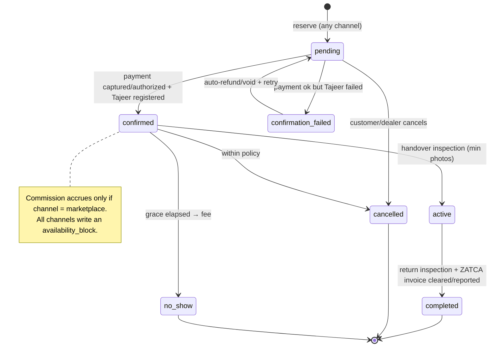
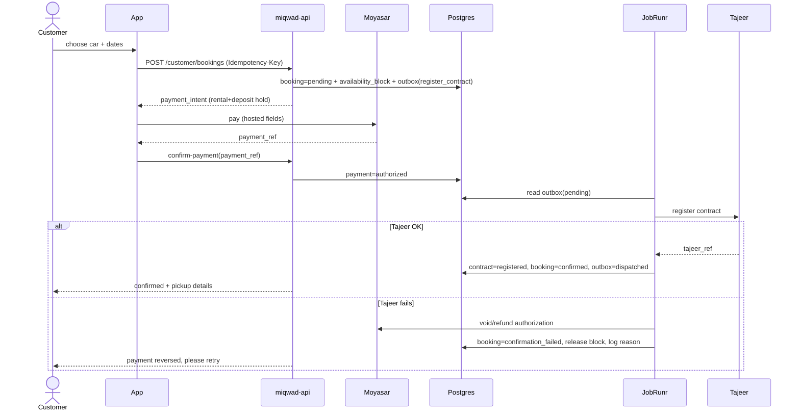
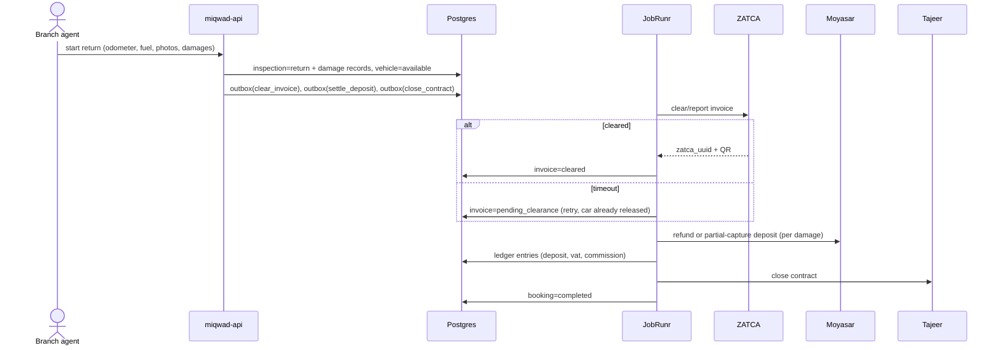
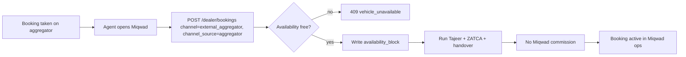
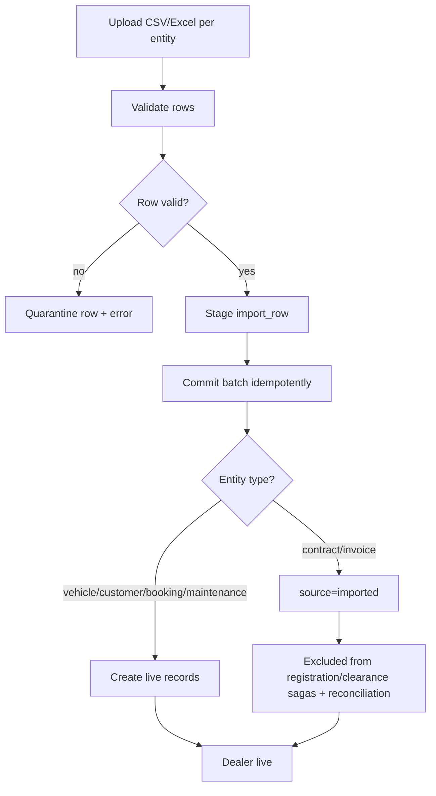
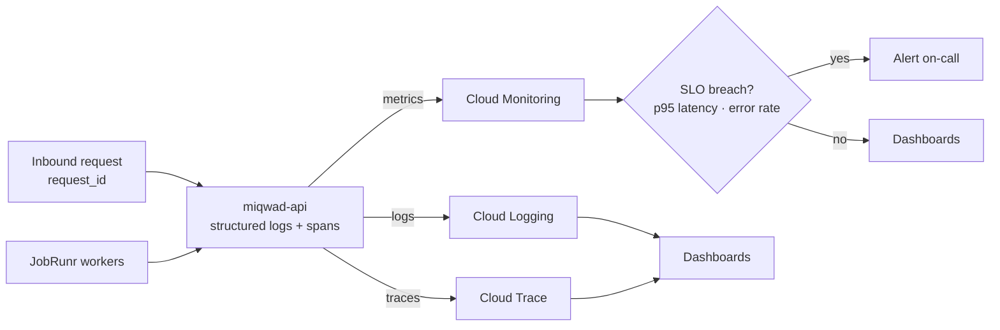
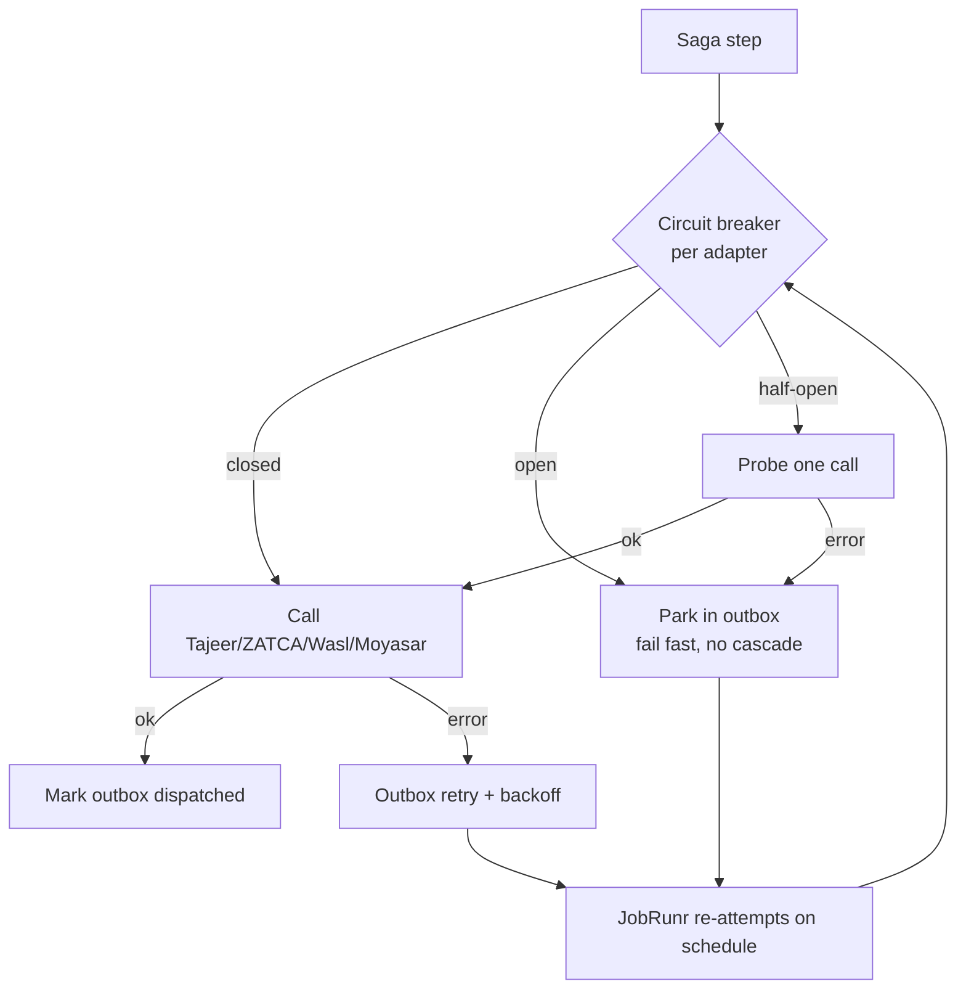
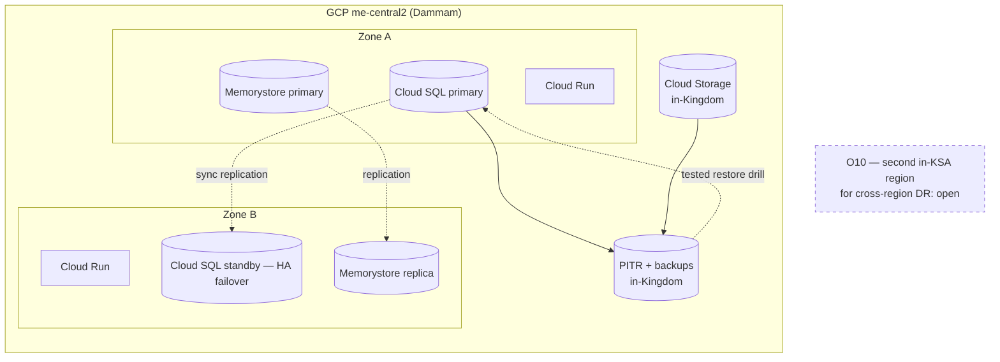

# Miqwad — System & UML Diagrams

The editable Mermaid source for every system diagram — the source of truth, regenerated into the rendered views. Renders on GitHub, VS Code, and most viewers.

> Cross-refs: ER diagram → [../architecture/data-model.md](../architecture/data-model.md); cloud topology → [../architecture/cloud.md](../architecture/cloud.md); sagas → [../architecture/sagas-outbox-jobs.md](../architecture/sagas-outbox-jobs.md); modules → [../architecture/README.md](../architecture/README.md). Stack: Kotlin · JDK 25 · Spring Boot 4 modular monolith · PostgreSQL + Redis · JobRunr · Moyasar · GCP me-central2.

---

## 1. Component / Architecture

Modules (packaging/entitlements, channels, delivery, reviews, Saher, import), the Elide-for-CRUD vs hand-built domain split, JobRunr/outbox, and GCP data services.



## 2. Booking state machine

Includes `confirmation_failed` (payment ok / Tajeer fail) and channel notes. Guards are hard preconditions.



## 3. Sequence — Book & Confirm (saga)

The transactional outbox + JobRunr dispatch + compensation.



## 4. Sequence — Return & Settle (saga)



## 5. Entitlement gating

Every dealer request passes RBAC + tenant scope + entitlement.

```mermaid
flowchart TD
  REQ[Dealer request] --> AUTH{Valid JWT?}
  AUTH -- no --> E401[401 unauthorized]
  AUTH -- yes --> TEN[Set tenant GUC from dealership_id]
  TEN --> RBAC{Role allows action?}
  RBAC -- no --> E403[403 forbidden]
  RBAC -- yes --> ENT[Resolve entitlement (cache)]
  ENT --> MOD{Module enabled?}
  MOD -- no --> EM[403 entitlement_module_disabled]
  MOD -- yes --> PKG{Package allows surface?}
  PKG -- no --> EP[403 entitlement_package_excluded]
  PKG -- yes --> LIM{Create within tier limit?}
  LIM -- no --> EL[402 entitlement_limit_reached + upgrade_to]
  LIM -- yes --> OK[Handle request]
  OK --> RLS[(Postgres RLS backstop)]
```

## 6. External-channel booking (aggregator)



## 7. Import / migration with gov-doc guard



## 8. Observability — request → trace → alert

The path from an inbound request through structured logs, metrics, and traces to alerting on the SLOs.



## 9. Resilience — external-outage isolation

Each government/payment adapter sits behind a Resilience4j circuit breaker so one outage can't cascade; work parks in the outbox and retries.



## 10. DR topology — me-central2 (Dammam)

V1 disaster recovery: single-region me-central2 multi-zone HA + point-in-time recovery + tested restore + in-Kingdom backup. A second in-KSA region for cross-region DR is an open item (O10).



## Diagrams carried forward unchanged

The Use-Case map, Class/Domain model (covered by the ER diagram + the low-level design), the Vehicle-Handover activity, and the External-Outage Resilience sequence remain valid from the original set and are regenerated into this file's Mermaid form when edited.
